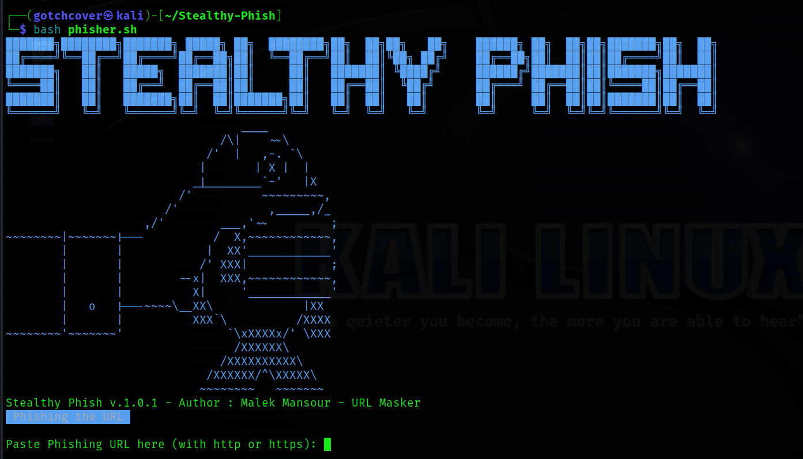

# Screenshot

# Stealthy Phish
Stealthy Phish is a Bash script designed to generate modified phishing URLs with masked domains and social engineering words. It provides a simple way to create more convincing phishing attacks by disguising the URLs and incorporating social engineering tactics.
# Installation
```
git clone https://github.com/MalekMansour/Stealthy-Phish.git
cd Stealthy-Phish
bash phisher.sh
```
# Legal Disclaimer
Warning: Phishing is illegal and unethical. This script is shared for educational purposes only. The purpose of Stealthy Phish is to raise awareness about potential phishing techniques and to encourage responsible use of information security. It is essential to respect the privacy and security of others and to comply with all applicable laws and regulations. The author takes no responsibility for any misuse or illegal activities conducted with this script.
# ASCII 
The ASCII art used in this script was sourced from https://ascii.co.uk/. Credit goes to the respective artist(s) who created the artwork.
